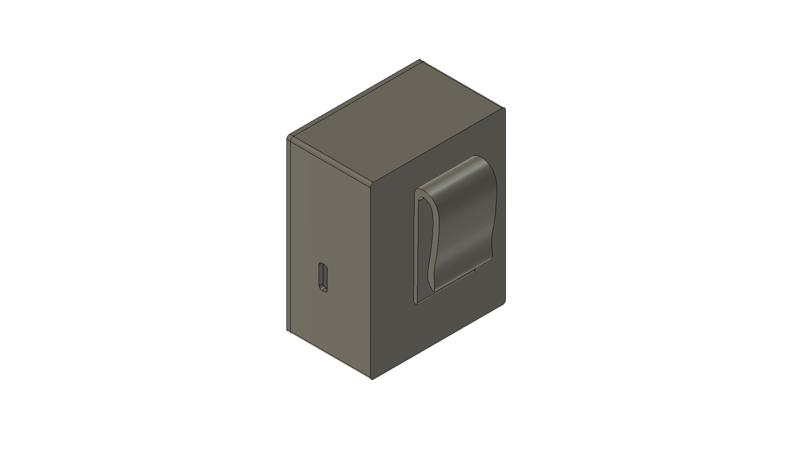

# Motion Quality Tracker

**Author**: Lovro Šantek, May 2025.

## Overview

**Motion Quality Tracker** is a wearable system designed to provide **real-time feedback** on exercise performance using motion analysis. It aims to help users perform exercises with correct form, minimizing injury risks and maximizing training efficiency. The solution leverages embedded AI for instant evaluation of movement quality.

---

## Problem Statement

Incorrect exercise technique is a widespread issue affecting:
- Beginners: leading to poor results.
- Experienced athletes: risking injuries and imbalances.
- Rehabilitation patients: struggling with proper guidance.

Traditional supervision is costly and time-consuming. There’s a need for **independent, intelligent feedback systems**.

---

## Solution

A compact wearable device that includes:
- **IMU sensor**: Collects movement data (acceleration + angular velocity).
- **ESP32 microcontroller**: Processes sensor data and runs on-device AI inference.
- **AI Model (TensorFlow Lite / LiteRT)**: Classifies motion patterns.
- **Wireless communication**: Integration with a web app.
- **3D printed case**: Lightweight and body-attachable.
- **Battery-powered (Li-ion + USB-C charging)**.

---

## Hardware Components

| Component                | Quantity | Price    | Link |
|-------------------------|----------|----------|------|
| ESP32-DevKit V1         | 1        | €9.50    | [Mouser](https://www.mouser.de/ProductDetail/Espressif-Systems/ESP32-DevKitC-VIE) |
| Li-ion battery (900mAh) | 1        | €6.95    | [Soldered](https://soldered.com/product/li-ion-battery-900mah-3-7v/) |
| BQ24295 Charger         | 1        | €12.50   | [Soldered](https://soldered.com/product/li-ion-charger-bq24295-with-5v-usb-output-board/) |
| IMU Sensor              | 1        | €17.10   | [Mouser](https://www.mouser.de/ProductDetail/Mikroe/MIKROE-4044) |
| PLA Filament            | 1        | €22.99   | [BambuLab](https://eu.store.bambulab.com/de/collections/pla/products/pla-basic-filament-de) |

**Total Cost**: €69.04

---

## System Architecture

- **Sensor**: IMU (Accelerometer + Gyroscope) via SPI
- **Controller**: ESP32 (Wi-Fi/MQTT)
- **Power**: Li-ion battery + BQ24295 charger
- **Software**: EdgeImpulse for data collection, LiteRT for inference
- **App**: Mobile/Web integration for feedback display

---

## Software Design

Structured in modular layers:

1. **Hardware Abstraction Layer (HAL)** – SPI interface, power management  
2. **Data Acquisition Module** – Gathers IMU data  
3. **AI Inference Module** – Real-time classification using LiteRT  
4. **Communication Module** – MQTT data transmission  

**Flowchart:**
1. Initialize System  
2. Acquire IMU Data  
3. Run AI Inference  
4. Send Output to an App

---

## Links

- [EdgeImpulse Studio](https://studio.edgeimpulse.com/)
- [LiteRT (Google Edge AI)](https://ai.google.dev/edge/litert)
- [FreeRTOS](https://www.freertos.org/)

---

## Enclosure

Custom 3D printed case to house all components and mount on the body safely and comfortably.
The case was modeled in [Fusion360](https://www.autodesk.com/products/fusion-360).  
Sideview of an enclosure:

---

## Acknowledgements

Thanks to everyone who participated in data collection for model training.

---
